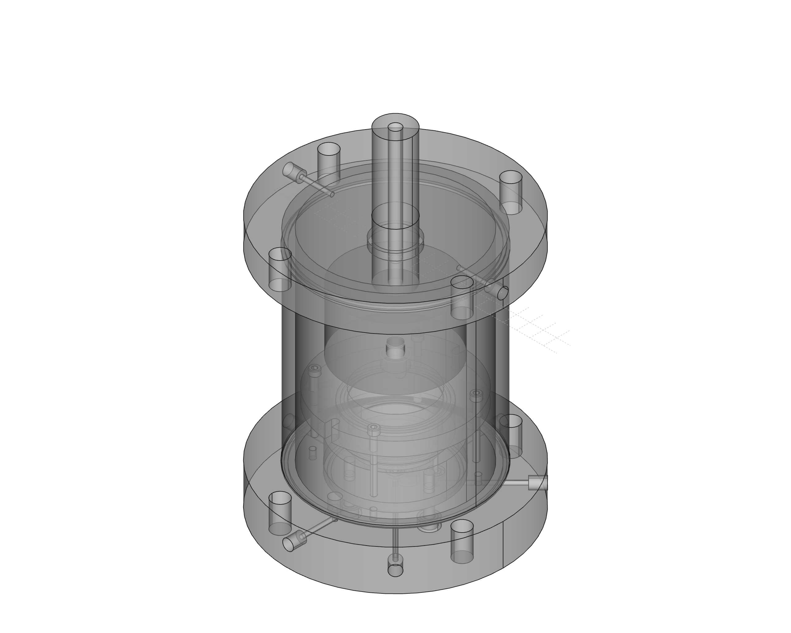
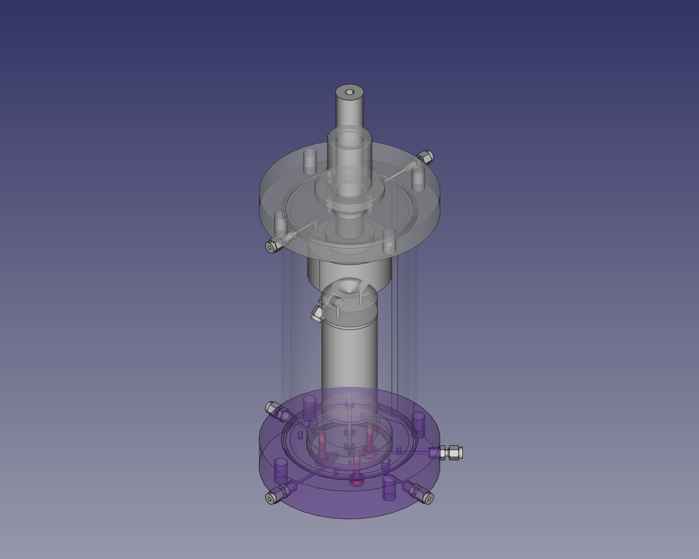

# UnsatOedometer
This project presents the design for a multifunction oedometer cell, that in addition to convention incremental loading, is capable of:
- constant rate of loading (CRL), constant rate of strain (CRS) or controlled gradient (CG) 
- suction control using the axis-translation technique with a high air-entry ceramic disc included in the base pedestal. Additionally, a ceramic disc may be included in the top cap to reduce the drainage path length, and ultimately testing times. 
- suction control using the vapour equilibrium technique

The design is intended to be modular, so that with some minor modifications (i.e. different pedestal and cell wall), most parts can be reused as a triaxial apparatus. 

A revised version of the oedometer has been updated to extend the system to triaxial capability...

